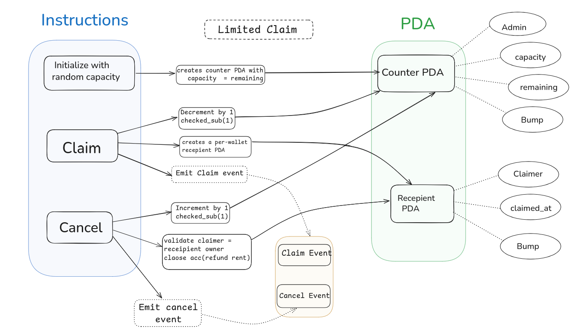

<div align="center">
  
</div>

# Limited Claim — Solana Anchor Program

A minimal on-chain system that manages a fixed number of available spots (for example: event seats, tickets, or access passes).  
The program ensures fairness by allowing only one claim per participant and automatically returning seats when claims are cancelled.

---

## User Story

**As an organizer**, I want to open a campaign with a fixed number of seats so I can limit how many people can claim.

**As a participant**, I want to claim one seat and be able to cancel it so the seat returns to the pool.

### Acceptance Criteria
- The organizer sets the total number of seats when creating the campaign.  
- A participant can claim a seat only if seats remain.  
- Each participant can hold at most one claim at a time.  
- A participant can cancel their claim and the seat becomes available again.  
- Seats available never go below zero or above the original total.  
- All claims and cancellations are recorded so anyone can verify current availability.

---

## Architecture Diagram

The diagram below explains how the **instructions** (`initialize_counter`, `claim`, and `cancel`) interact with their **Program Derived Accounts (PDAs)** such as `Counter` and `ClaimReceipt`.



---

## How It Works (Short)
1. Organizer creates the campaign and sets total seats.  
2. Participants claim one seat each. A claim is recorded.  
3. Participants can cancel their claim, freeing the seat.  
4. The system enforces limits and records changes on-chain for public verification.

---

## How to Run (Local)
```bash
# clone
git clone <your_repo_url>
cd limited-claim

# build
anchor build

# deploy (local validator or devnet)
anchor deploy

# (optional) run tests
anchor test
